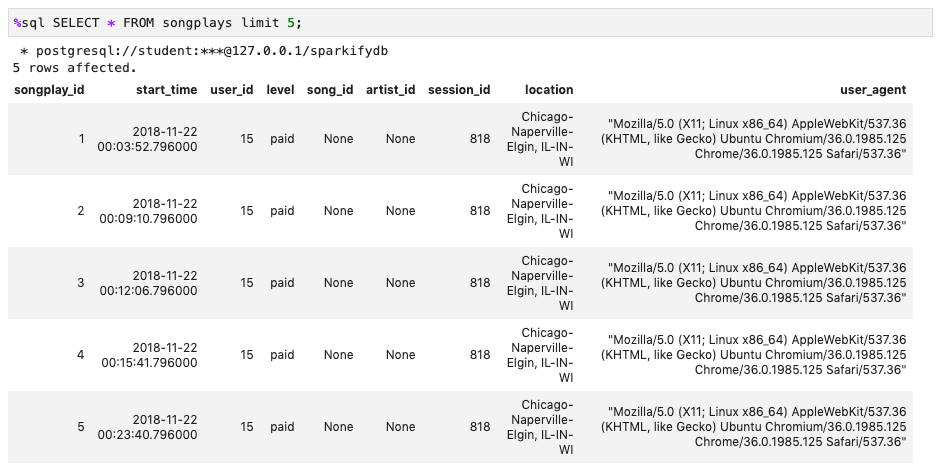
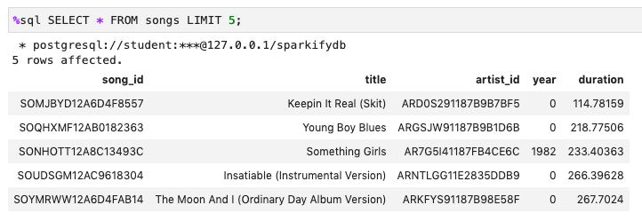
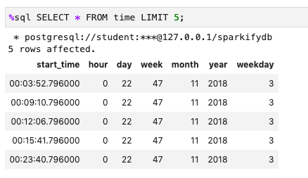
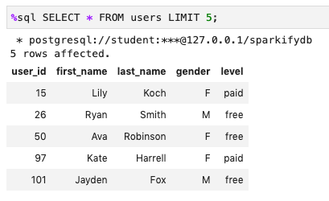
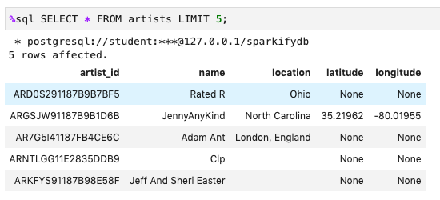

# udacity data modeling with postgres

**Goal:**  Create Sparkify database schema that surfaces a songplay fact table and supporting core dimension tables.  Tables would allow further investigation of song play customer-song artist actions.  Examples would be to understand which artists users stream the most, average duration of top songs played, etc.

**Schema details** Build out artist, user, song, and time dimension tables.  Artist and song tables will be linked by artist id.  The song play time table will be used to provide more detail around provided. timestamp information, assumption is that various date views will be desired in end reporting.  Finally a songplay fact table will be created for easy analysis of the user-song-artist play events.  Fact Table will allow analyst to look at total songs played by user and artist, as well as details around when and what sort of technology they are using.

Dimension tables are used as unique identifiers for users, songs, and artists, we create these tables to avoid storing extra details in the fact tables such as user/artist name, locations, etc.  There is also a tangible reduction in the amount of data needed to be stored in the songplays fact table as the user dimension table is essentially de-coupling much of the user information (first name, last name, gender...) while leaving the user_id field in songplays for joining.  The user, songs, artists, and time table also contain unique values so essentially store less data at the dimension level than what was being populated in a log file (same song gets played multiple times, user plays many songs, etc).

Tables details and constraints are as follows:
* songplays fact table - songplay_id (primary key, increments via serial data type) start_time, user_id (not null constraint to ensure user data is populated), level, song_id, artist_id, session_id, location, user_agent
* users dimension table - user_id (primary key joins to songplays table), first_name, last_name, gender, level
* songs dimension table - song_id (primary key joins to songplay table), title, artist_id, year, duration
* artists dimension table - artist_id (primary key joins to songplays table), name, location, latitude, longitude
* time dimension table - start_time (primary key joins to songplays table), hour, day, week, month, year, weekday

**Etl details** Loop through each raw json file in the data directory, processing song and log files.  Detail number of files processed.  
  Song files - Loop through each file and build out song and artist dimension tables
  Log Files - Loop through each file and extract contents to build song and user dimension tables.  User a sub query   to join the raw json contents combined with now existing song and artist table to to create a songplay fact table
  
**Sample Query Analysis**
--count of songs played by song name in logs - SELECT title, count(songplay_id) as song_count FROM songplays s join songs o on o.song_id = s.song_id group by 1 order by 2 desc;
results - Setanta matins	1

--count of artists played by artist name in logs - SELECT a.name, count(s.artist_id) as artist_count FROM songplays s join artists a on a.artist_id = s.artist_id group by 1 order by 2 desc;
results - Elena	1

**Running the Files from home/workspace/directory**
1.  python create_tables.py - connects to the database, drops and creates tables
2.  python etl.py - accesses song and log files, builds out database tables

**Sql Tables Created**
* songplays - details of songs played on music service, data includes songplay_id (unique), startime (timestamp), user_id, level, song_id, artist_id, session_id, location, user_agent
* users - user_id (key to songplays), first_name, last_name, gender, level
* songs - song_id, title, artist_id (key to songplays), year, duration
* artists - artist_id, name, location, latitude, longitude
* time - start_time, hour, day, week, month, year, weekday

